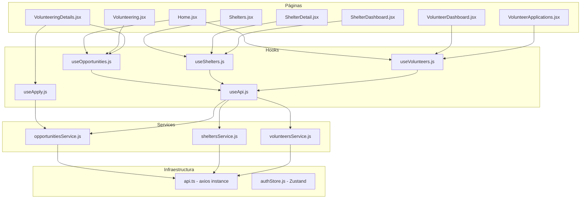
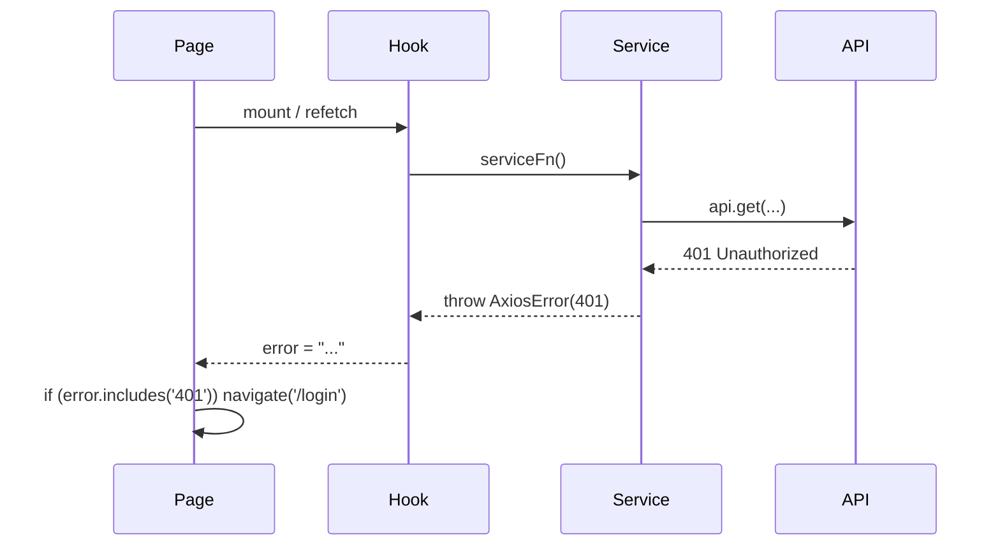

# Documento de Diseño Técnico

## Overview

Este documento describe la arquitectura para integrar el frontend React de **Paws to the Rescue** con la API REST del backend NestJS. Se eliminará toda la data mock/hardcoded y se reemplazará con llamadas reales a la API a través de una capa de servicios, hooks personalizados de data fetching, y componentes reutilizables de estado (loading, error, empty).

La arquitectura sigue un patrón de tres capas:
1. **Service Layer** — funciones puras que encapsulan HTTP
2. **Custom Hooks** — lógica reactiva de `useState`/`useEffect`
3. **Componentes UI** — consumen hooks y renderizan estados

---

## Architecture



---

## Components and Interfaces

### 1. Service Layer

Cada archivo de servicio exporta funciones que usan la instancia `api` existente de `services/api.ts`.

#### `services/opportunitiesService.js`

```javascript
import { api } from './api';

export const getOpportunities = (filters = {}) => {
  const params = new URLSearchParams();
  if (filters.category) params.append('category', filters.category);
  if (filters.location) params.append('location', filters.location);
  return api.get('/opportunities', { params }).then(res => res.data);
};

export const getOpportunityById = (id) =>
  api.get(`/opportunities/${id}`).then(res => res.data);

export const applyToOpportunity = (opportunityId) =>
  api.post(`/opportunities/${opportunityId}/apply`).then(res => res.data);
```

#### `services/sheltersService.js`

```javascript
import { api } from './api';

export const getShelters = () =>
  api.get('/shelters').then(res => res.data);

export const getShelterById = (id) =>
  api.get(`/shelters/${id}`).then(res => res.data);

export const getShelterDashboard = () =>
  api.get('/shelters/me/dashboard').then(res => res.data);

export const getShelterRecentApplications = () =>
  api.get('/shelters/me/applications/recent').then(res => res.data);
```

#### `services/volunteersService.js`

```javascript
import { api } from './api';

export const getTopMonthlyVolunteers = () =>
  api.get('/volunteers/top-monthly').then(res => res.data);

export const getVolunteerDashboard = () =>
  api.get('/volunteers/me/dashboard').then(res => res.data);

export const getVolunteerActivity = () =>
  api.get('/volunteers/me/activity').then(res => res.data);

export const getVolunteerRecommendations = () =>
  api.get('/volunteers/me/recommendations').then(res => res.data);

export const getVolunteerApplications = (status) => {
  const params = status ? { status } : {};
  return api.get('/volunteers/me/applications', { params }).then(res => res.data);
};
```

### 2. Custom Hooks

#### `hooks/useApi.js` — Hook genérico de data fetching

```javascript
import { useState, useEffect, useCallback } from 'react';

export function useApi(serviceFn, ...args) {
  const [data, setData] = useState(null);
  const [loading, setLoading] = useState(true);
  const [error, setError] = useState(null);

  const fetch = useCallback(async () => {
    setLoading(true);
    setError(null);
    try {
      const result = await serviceFn(...args);
      setData(result);
    } catch (err) {
      setError(err.response?.data?.message || err.message || 'Error desconocido');
      setData(null);
    } finally {
      setLoading(false);
    }
  }, [serviceFn, ...args]);

  useEffect(() => {
    fetch();
  }, [fetch]);

  return { data, loading, error, refetch: fetch };
}
```

#### `hooks/useOpportunities.js`

```javascript
import { useApi } from './useApi';
import { getOpportunities, getOpportunityById } from '../services/opportunitiesService';

export const useOpportunities = (filters) =>
  useApi(getOpportunities, filters);

export const useOpportunityDetail = (id) =>
  useApi(getOpportunityById, id);
```

#### `hooks/useShelters.js`

```javascript
import { useApi } from './useApi';
import { getShelters, getShelterById, getShelterDashboard, getShelterRecentApplications } from '../services/sheltersService';

export const useShelters = () => useApi(getShelters);
export const useShelterDetail = (id) => useApi(getShelterById, id);
export const useShelterDashboard = () => useApi(getShelterDashboard);
export const useShelterRecentApplications = () => useApi(getShelterRecentApplications);
```

#### `hooks/useVolunteers.js`

```javascript
import { useApi } from './useApi';
import {
  getTopMonthlyVolunteers,
  getVolunteerDashboard,
  getVolunteerActivity,
  getVolunteerRecommendations,
  getVolunteerApplications,
} from '../services/volunteersService';

export const useTopVolunteers = () => useApi(getTopMonthlyVolunteers);
export const useVolunteerDashboard = () => useApi(getVolunteerDashboard);
export const useVolunteerActivity = () => useApi(getVolunteerActivity);
export const useVolunteerRecommendations = () => useApi(getVolunteerRecommendations);
export const useVolunteerApplications = (status) => useApi(getVolunteerApplications, status);
```

#### `hooks/useApply.js` — Hook de mutación

```javascript
import { useState, useCallback } from 'react';
import { applyToOpportunity } from '../services/opportunitiesService';

export function useApply() {
  const [loading, setLoading] = useState(false);
  const [error, setError] = useState(null);
  const [success, setSuccess] = useState(false);

  const apply = useCallback(async (opportunityId) => {
    setLoading(true);
    setError(null);
    setSuccess(false);
    try {
      await applyToOpportunity(opportunityId);
      setSuccess(true);
    } catch (err) {
      const status = err.response?.status;
      if (status === 409) {
        setError('Ya tienes una aplicación activa para esta oportunidad.');
      } else if (status === 404) {
        setError('La oportunidad no existe.');
      } else if (status === 401) {
        // La redirección se maneja en el componente
        setError('AUTH_REQUIRED');
      } else {
        setError(err.response?.data?.message || 'Error al aplicar.');
      }
    } finally {
      setLoading(false);
    }
  }, []);

  return { apply, loading, error, success };
}
```

### 3. Componentes UI Reutilizables

#### `components/LoadingSpinner.jsx`

```jsx
export const LoadingSpinner = ({ className = '' }) => (
  <div className={`flex justify-center items-center py-12 ${className}`}>
    <div className="animate-spin rounded-full h-10 w-10 border-4 border-primary border-t-transparent" />
  </div>
);
```

#### `components/ErrorMessage.jsx`

```jsx
export const ErrorMessage = ({ message, onRetry }) => (
  <div className="flex flex-col items-center justify-center py-12 text-center">
    <p className="text-red-600 font-medium mb-4">{message}</p>
    {onRetry && (
      <button
        onClick={onRetry}
        className="px-4 py-2 bg-primary text-white rounded-lg hover:bg-primary-dark transition"
      >
        Reintentar
      </button>
    )}
  </div>
);
```

#### `components/EmptyState.jsx`

```jsx
export const EmptyState = ({ message }) => (
  <div className="flex flex-col items-center justify-center py-12 text-center">
    <p className="text-gray-500 text-lg">{message}</p>
  </div>
);
```

---

## Data Models

Los modelos de datos ya están definidos por el backend. El frontend consume directamente las respuestas JSON. A continuación se documenta la forma esperada de cada respuesta relevante:

### Opportunity (respuesta de GET /opportunities)
```javascript
{
  id: "uuid",
  name: "string",
  category: "string",
  location: "string",
  date: "string",
  duration: "string",
  image: "string | null",
  totalSpaces: 5,
  availableSpaces: 3,
  isActive: true,
  shelterName: { name: "string", logo: "string | null" }
}
```

### Shelter (respuesta de GET /shelters)
```javascript
{
  id: "uuid",
  name: "string",
  description: "string | null",
  location: "string",
  contactNumber: "string | null",
  animalCapacity: 80,
  totalAnimals: 45,
  logo: "string | null",
  activeVolunteerOpportunities: 5
}
```

### Volunteer Top Monthly (respuesta de GET /volunteers/top-monthly)
```javascript
{
  place: 1,
  name: "string",
  hours: 245,
  label: "Volunteer of the Month"
}
```

### Volunteer Dashboard (respuesta de GET /volunteers/me/dashboard)
```javascript
{
  name: "string",
  role: "string",
  since: "Oct 2023",
  totalHours: 128,
  sheltersAssisted: 12
}
```

### Application (respuesta de GET /volunteers/me/applications)
```javascript
{
  id: "uuid",
  title: "string",
  shelter: "string",
  location: "string",
  date: "string",
  hours: 3,
  status: "pending | approved | rejected"
}
```

---

## Error Handling

### Estrategia por capa

| Capa | Responsabilidad |
|------|-----------------|
| Service Layer | Propaga errores sin capturarlos (`throw`) |
| useApi hook | Captura errores, extrae mensaje, actualiza state |
| useApply hook | Manejo específico por código HTTP (401, 404, 409) |
| Componente página | Decide qué renderizar según `error`, maneja redirección 401 |

### Flujo de error 401 en páginas protegidas



Las páginas protegidas (`VolunteerDashboard`, `ShelterDashboard`, `VolunteerApplications`) verificarán el código de error y usarán `useNavigate()` de react-router-dom para redirigir a `/login`.

---

## Testing Strategy

### Enfoque

Esta integración frontend es principalmente **CRUD wiring** — conectar componentes UI con endpoints de backend. No involucra transformaciones de datos complejas, parsers, ni lógica algorítmica que varíe significativamente con el input.

**Property-based testing NO es aplicable** para esta feature porque:
- Las funciones de servicio son wrappers delgados sobre axios (no hay lógica de transformación)
- Los hooks siguen un patrón mecánico de `useState`/`useEffect` (no hay lógica de negocio)
- Los componentes de UI (LoadingSpinner, ErrorMessage, EmptyState) son puramente visuales
- La integración en páginas es wiring entre hooks y componentes existentes

### Testing recomendado

1. **Unit tests (ejemplo-based)** para los hooks con mocks de axios:
   - Verificar que `useApi` transiciona correctamente entre estados `loading → data` y `loading → error`
   - Verificar que `useApply` mapea correctamente códigos HTTP a mensajes

2. **Integration tests** para verificar que las páginas renderizan correctamente:
   - Mock del service layer, verificar que la página muestra `LoadingSpinner` durante carga
   - Verificar que la página muestra `ErrorMessage` cuando hay error
   - Verificar que la página muestra `EmptyState` cuando el array está vacío

3. **Manual/E2E testing** para validar la integración completa con el backend real.

---

## Decisiones de Diseño

1. **Sin nuevas dependencias**: Se usan `useState`/`useEffect` nativos de React. No se introduce React Query ni SWR para mantener la simplicidad del proyecto y evitar sobre-ingeniería para una app de esta escala.

2. **Extensión `.js` para hooks y servicios, `.jsx` para componentes React**: Consistente con las convenciones existentes del proyecto.

3. **Service layer como funciones puras**: Cada función retorna una Promise con `response.data`. Esto facilita testing y reutilización sin acoplamiento a React.

4. **Hook genérico `useApi` + hooks específicos**: El genérico maneja el boilerplate (loading/error/data), los específicos proveen una API semántica clara para cada componente.

5. **Hook de mutación separado (`useApply`)**: Las mutaciones tienen un ciclo de vida diferente a las queries (no se ejecutan en mount, manejan success/error de forma distinta). Se separan para claridad.

6. **Redirección 401 en el componente, no en interceptor global**: Permite que componentes no protegidos (páginas públicas) manejen 401 de forma diferente. El interceptor de axios solo agrega el token, no maneja errores.

---

## Estructura de Archivos (Final)

```
Frontend/src/
├── services/
│   ├── api.ts                     (EXISTENTE - sin cambios)
│   ├── supabase.js                (EXISTENTE - sin cambios)
│   ├── supabaseAuth.js            (EXISTENTE - sin cambios)
│   ├── opportunitiesService.js    (NUEVO)
│   ├── sheltersService.js         (NUEVO)
│   └── volunteersService.js       (NUEVO)
│   └── volunteeringData.js        (ELIMINAR)
├── hooks/
│   ├── useFormState.js            (EXISTENTE - sin cambios)
│   ├── useFormSubmit.js           (EXISTENTE - sin cambios)
│   ├── useApi.js                  (NUEVO)
│   ├── useOpportunities.js        (NUEVO)
│   ├── useShelters.js             (NUEVO)
│   ├── useVolunteers.js           (NUEVO)
│   └── useApply.js                (NUEVO)
├── components/
│   ├── LoadingSpinner.jsx         (NUEVO)
│   ├── ErrorMessage.jsx           (NUEVO)
│   └── EmptyState.jsx             (NUEVO)
├── store/
│   └── authStore.js               (EXISTENTE - sin cambios)
├── pages/                         (MODIFICAR - reemplazar mocks por hooks)
├── features/                      (MODIFICAR - reemplazar mocks por props/hooks)
└── layouts/                       (SIN CAMBIOS)
```
