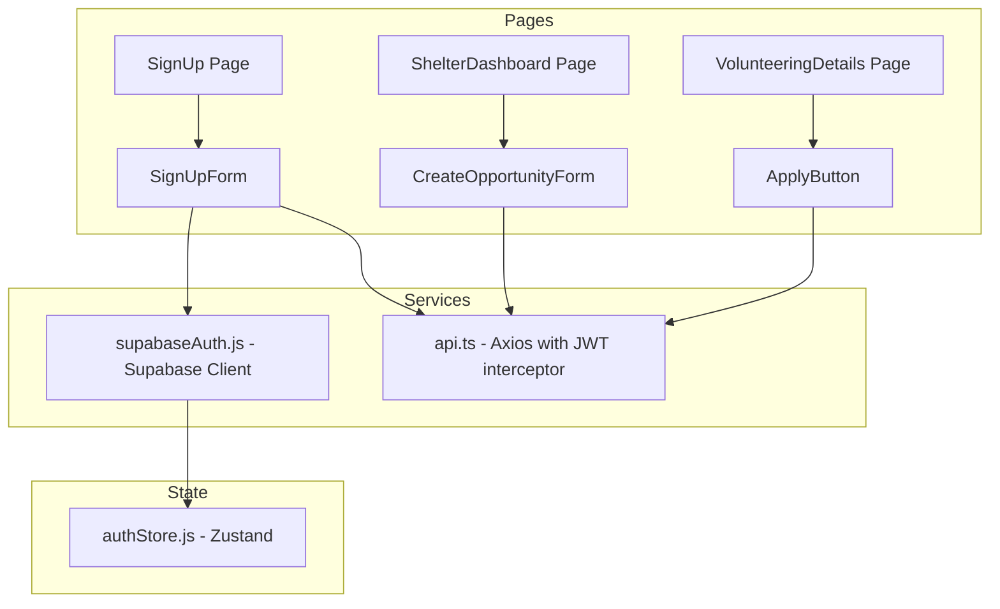
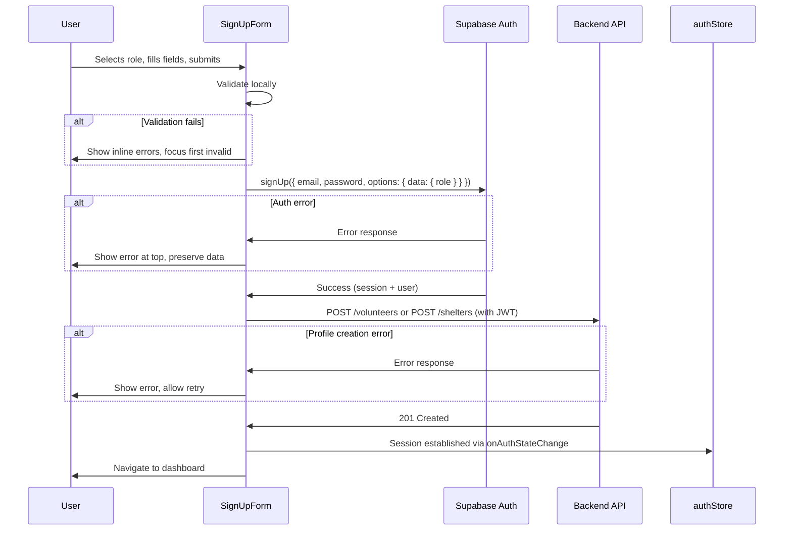
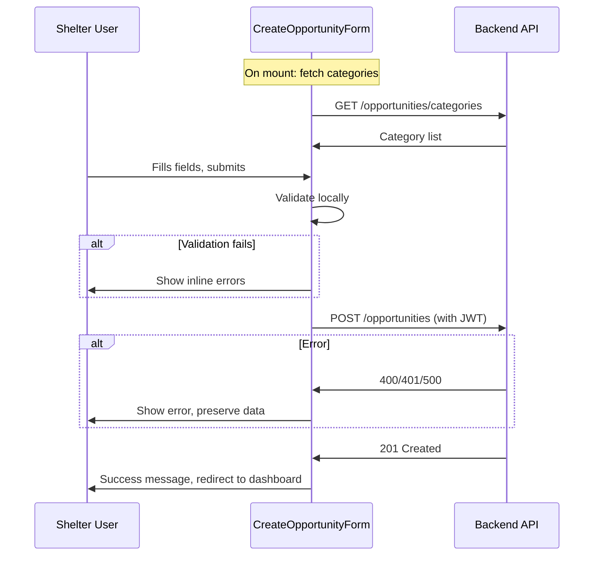
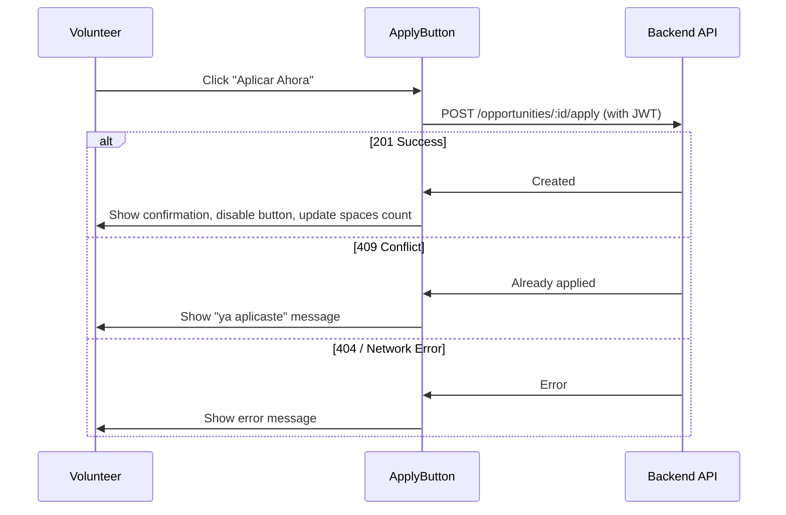

# Design Document: Frontend Forms

## Overview

This design covers three form systems for the "Paws to the Rescue" frontend application:

1. **Registration Form** — A role-aware sign-up form that dynamically renders volunteer or shelter fields based on user selection, handles Supabase Auth registration, and creates the corresponding profile via the backend API.
2. **Create Opportunity Form** — A shelter-only form for creating volunteer opportunities with category selection, date validation, and backend submission.
3. **Apply to Opportunity** — A single-action button flow allowing volunteers to sign up for open opportunities.

All forms follow the existing project conventions: React functional components with hooks, Zustand for global state, Axios (via `api.ts` interceptor) for authenticated API calls, Supabase client for auth, Tailwind CSS for styling, and `lucide-react` for icons.

### Key Design Decisions

| Decision | Rationale |
|----------|-----------|
| Custom validation with `useState` hooks (no form library) | The project has no form library installed (no react-hook-form, formik). Adding one for 3 forms introduces unnecessary dependency. The existing pattern uses `useState` per field. |
| Validation logic extracted into pure utility functions | Enables property-based testing of validation rules independent of React components. |
| Two-step registration (Supabase Auth → Backend API) | Required by the schema: `profiles` table FK to `auth.users`, then `volunteers`/`shelters` FK to `profiles`. Backend handles profile creation atomically. |
| Apply endpoint uses `POST /opportunities/:id/apply` | Already implemented in the backend `OpportunitiesController`. Maps to `sign_up_volunteers` table insertion. |

## Architecture



### Data Flow: Registration



### Data Flow: Create Opportunity



### Data Flow: Apply to Opportunity



## Components and Interfaces

### New Components

| Component | Location | Purpose |
|-----------|----------|---------|
| `RoleSelector` | `features/auth/RoleSelector.jsx` | Toggle between "Voluntario" and "Refugio" roles |
| `SignUpForm` (refactored) | `features/auth/SignUpForm.jsx` | Role-aware registration with dynamic fields |
| `VolunteerFields` | `features/auth/VolunteerFields.jsx` | Volunteer-specific form fields |
| `ShelterFields` | `features/auth/ShelterFields.jsx` | Shelter-specific form fields |
| `CreateOpportunityForm` | `features/shelterDashboard/CreateOpportunityForm.jsx` | Opportunity creation form |
| `CreateOpportunityPage` | `pages/CreateOpportunity.jsx` | Page wrapper for the form |
| `ApplyButton` | `features/volunteering/ApplyButton.jsx` | Apply action with loading/error states |
| `FormField` | `components/FormField.jsx` | Reusable accessible input field with label, error, and ARIA attributes |
| `FormError` | `components/FormError.jsx` | Top-level form error display |

### Component Interfaces

```jsx
// FormField - Reusable accessible form field wrapper
interface FormFieldProps {
  id: string;              // Unique field id (used for htmlFor, aria-describedby)
  label: string;           // Label text
  type?: string;           // Input type (text, email, password, number, date, url)
  value: string | number;
  onChange: (value: string) => void;
  error?: string | null;   // Validation error message
  required?: boolean;
  placeholder?: string;
  maxLength?: number;
  min?: number;
  max?: number;
  disabled?: boolean;
  icon?: React.ReactNode;  // Optional lucide-react icon
}

// RoleSelector
interface RoleSelectorProps {
  selectedRole: 'volunteer' | 'shelter' | null;
  onChange: (role: 'volunteer' | 'shelter') => void;
}

// ApplyButton
interface ApplyButtonProps {
  opportunityId: string;
  status: 'open' | 'full' | 'completed' | 'cancelled';
  availableSpaces: number;
  onApplySuccess: () => void;  // Callback to refresh parent state
}
```

### Validation Utilities

Located at `Frontend/src/utils/formValidation.js`:

```javascript
/**
 * Pure validation functions for form fields.
 * Each returns null for valid input, or an error message string for invalid input.
 */

export function validateRequired(value, fieldName) { ... }
export function validateEmail(value) { ... }
export function validateMinLength(value, min, fieldName) { ... }
export function validateMaxLength(value, max, fieldName) { ... }
export function validateIntRange(value, min, max, fieldName) { ... }
export function validateUrl(value) { ... }
export function validateFutureDate(value) { ... }

/**
 * Runs a list of validator functions on a value, returning the first error or null.
 */
export function runValidators(value, validators) { ... }

/**
 * Validates an entire form object against a schema of validators.
 * Returns { isValid: boolean, errors: Record<string, string | null> }
 */
export function validateForm(values, schema) { ... }
```

### Custom Hooks

Located at `Frontend/src/hooks/`:

```javascript
// useFormState.js - Generic form state management
function useFormState(initialValues) {
  // Returns: { values, errors, setField, setError, clearErrors, resetFields, validate }
}

// useFormSubmit.js - Async submission with loading/error handling
function useFormSubmit(submitFn) {
  // Returns: { submit, isSubmitting, submitError, clearSubmitError }
}
```

## Data Models

### Registration Form State

```javascript
// Volunteer registration
{
  role: 'volunteer',
  email: '',
  password: '',
  name: '',          // maps to volunteers.name
  lastName: '',      // maps to volunteers.last_name
  description: '',   // maps to volunteers.description
  skills: '',        // maps to volunteers.skills (stored as text)
  contactNumber: '', // maps to volunteers.contact_number
}

// Shelter registration
{
  role: 'shelter',
  email: '',
  password: '',
  shelterName: '',     // maps to shelters.shelter_name
  location: '',        // maps to shelters.location
  description: '',     // maps to shelters.description
  contactNumber: '',   // maps to shelters.contact_number
  animalCapacity: '',  // maps to shelters.animal_capacity (integer)
  logo: '',            // maps to shelters.logo (URL)
}
```

### Create Opportunity Form State

```javascript
{
  name: '',                // maps to opportunities.name
  category: '',            // maps to opportunity_category_id (via lookup)
  location: '',            // maps to opportunities.location
  date: '',                // maps to opportunities.date (ISO string)
  duration: '',            // maps to opportunities.duration
  totalSpaces: '',         // maps to opportunities.total_available_spaces
  image: '',               // maps to opportunities.image (URL, optional)
}
```

### API Payloads

```javascript
// POST /volunteers (after Supabase Auth success)
{
  name: "string",
  lastName: "string",
  description: "string | undefined",
  skills: "string | undefined",
  contactNumber: "string | undefined"
}

// POST /shelters (after Supabase Auth success)
{
  name: "string",          // shelter_name
  location: "string",
  description: "string | undefined",
  contactNumber: "string | undefined",
  animalCapacity: "number | undefined",
  logo: "string | undefined"
}

// POST /opportunities
{
  name: "string",
  category: "string",
  location: "string",
  date: "string",          // ISO date string
  duration: "string",
  totalSpaces: number,
  image: "string | undefined"
}

// POST /opportunities/:id/apply
// No body - uses JWT token to identify volunteer
```

### Validation Schemas

```javascript
// Volunteer registration validation schema
const volunteerSchema = {
  name: [required, maxLength(100)],
  lastName: [required, maxLength(100)],
  email: [required, validEmail],
  password: [required, minLength(6)],
  description: [maxLength(500)],
  skills: [],  // optional, no constraints
  contactNumber: [maxLength(20)],
}

// Shelter registration validation schema
const shelterSchema = {
  shelterName: [required, maxLength(150)],
  email: [required, validEmail],
  password: [required, minLength(6)],
  location: [required, maxLength(200)],
  description: [maxLength(500)],
  contactNumber: [maxLength(20)],
  animalCapacity: [intRange(1, 10000)],  // optional but if provided must be valid
  logo: [validUrl],                       // optional but if provided must be valid URL
}

// Create opportunity validation schema
const opportunitySchema = {
  name: [required, maxLength(200)],
  category: [required],
  location: [required, maxLength(200)],
  date: [required, futureDate],
  duration: [required],
  totalSpaces: [required, intRange(1, 10000)],
  image: [validUrl],  // optional but if provided must be valid URL
}
```

## Correctness Properties

*A property is a characteristic or behavior that should hold true across all valid executions of a system — essentially, a formal statement about what the system should do. Properties serve as the bridge between human-readable specifications and machine-verifiable correctness guarantees.*

### Property 1: Role switching clears role-specific field values

*For any* set of non-empty values entered into role-specific fields (volunteer or shelter), when the user switches to the other role via the RoleSelector, all previously entered role-specific values should be cleared and not carried over.

**Validates: Requirements 1.4**

### Property 2: Required field validation rejects empty submissions

*For any* combination of empty required fields in the registration form (regardless of role), submitting the form should produce exactly one error message per empty required field, and the form submission should be prevented.

**Validates: Requirements 2.1, 3.3, 4.1**

### Property 3: Registration field validators reject invalid input

*For any* string that does not match the email pattern, `validateEmail` should return an error. *For any* string with length less than 6, `validateMinLength(value, 6)` should return an error. *For any* value that is non-numeric, less than 1, or greater than 10000, `validateIntRange(value, 1, 10000)` should return an error.

**Validates: Requirements 2.2, 2.3, 2.4**

### Property 4: Opportunity form field validators reject invalid input

*For any* numeric value less than 1 or greater than 10000, the total spaces validator should return an error. *For any* date string representing a day before today, the future date validator should return an error. *For any* non-empty string that is not a valid URL, the URL validator should return an error.

**Validates: Requirements 4.2, 4.3, 4.7**

### Property 5: Correcting a field value clears its validation error

*For any* form field that currently displays a validation error, when the user enters a new value that satisfies the field's validation rules, the error message for that field should be removed and `aria-invalid` should be set to `"false"`.

**Validates: Requirements 2.7, 6.4**

### Property 6: Form fields have proper ARIA label associations

*For any* form field rendered in the registration, create opportunity, or apply forms, the field should have: (a) a `<label>` element with `htmlFor` matching the field's `id`, (b) `aria-required="true"` if the field is required, and (c) when an error is displayed, `aria-describedby` referencing the error element's `id`.

**Validates: Requirements 6.1, 6.2, 6.6**

### Property 7: Focus moves to first invalid field on form submission

*For any* set of validation errors produced by form submission, the focus should move to the field corresponding to the first error in visual (DOM) order.

**Validates: Requirements 6.5**

## Error Handling

### Registration Form Errors

| Error Source | Condition | User-Facing Behavior |
|-------------|-----------|---------------------|
| Client validation | Missing required fields, invalid format | Inline error under each field; focus first invalid field |
| Supabase Auth | Email already registered | Top-level error banner: "Este email ya está registrado" |
| Supabase Auth | Weak password | Top-level error banner with Supabase message |
| Backend API | POST /volunteers or /shelters fails | Error banner: "No se pudo crear el perfil. Intenta de nuevo." + retry button |
| Network | Request timeout / no connectivity | Error banner: "Error de conexión. Verifica tu internet." |

### Create Opportunity Form Errors

| Error Source | Condition | User-Facing Behavior |
|-------------|-----------|---------------------|
| Client validation | Invalid fields | Inline errors per field |
| Backend API | 400 Bad Request | Top-level error with backend message |
| Backend API | 401 Unauthorized | Redirect to login |
| Backend API | 500 Server Error | Generic server error message |
| Categories fetch | Failed to load | Category selector disabled, form submission blocked |
| Timeout | 30s elapsed | "La solicitud tardó demasiado. Intenta de nuevo." |

### Apply Button Errors

| Error Source | Condition | User-Facing Behavior |
|-------------|-----------|---------------------|
| Backend API | 201 Created | Success toast, button disabled, counter decremented |
| Backend API | 409 Conflict | "Ya tienes una aplicación activa para esta oportunidad" |
| Backend API | 404 Not Found | "Oportunidad no encontrada" |
| Network | Connection error | "Error de conexión. Intenta de nuevo." |

### Error Recovery Strategy

- **Validation errors**: Auto-clear when user corrects the field value (on `onChange`)
- **Auth errors**: Preserved until next submission attempt
- **API errors (profile creation)**: Show retry button that re-attempts only the failed API call (Supabase auth already succeeded)
- **Category fetch failure**: Auto-retry on component remount; show "Reintentar" button

## Testing Strategy

### Unit Tests (Example-Based)

Focus on specific scenarios and component rendering:

- Registration form renders role selector with both options, none preselected
- Selecting "Voluntario" shows volunteer-specific fields
- Selecting "Refugio" shows shelter-specific fields
- Successful volunteer registration calls Supabase then POST /volunteers in sequence
- Successful shelter registration calls Supabase then POST /shelters in sequence
- Auth error displays at form top and preserves entered data
- Profile creation error shows retry mechanism
- Create Opportunity form loads categories from API on mount
- Category fetch failure disables the form
- Apply button shows enabled for volunteer + open opportunity
- Apply button shows disabled for unauthenticated users with login link
- Apply 201 response disables button and updates counter
- Apply 409 response shows duplicate message
- Loading states disable submit buttons with correct text

### Property-Based Tests

Each property test runs a minimum of 100 iterations using **fast-check** (the standard PBT library for JavaScript/TypeScript).

Configuration:
- Library: `fast-check` (npm package)
- Minimum iterations: 100
- Tag format: `Feature: frontend-forms, Property N: <description>`

Property tests target the pure validation utility functions in `utils/formValidation.js`:

1. **Property 1** — Role switching: Generate random form data for each role, simulate switch, verify cleared state
2. **Property 2** — Required field validation: Generate random subsets of empty fields, verify error count matches empty count
3. **Property 3** — Registration validators: Generate invalid emails/passwords/capacities, verify rejection
4. **Property 4** — Opportunity validators: Generate out-of-range numbers, past dates, invalid URLs, verify rejection
5. **Property 5** — Error clearing: Generate field with error then valid value, verify error clears
6. **Property 6** — ARIA associations: Render forms, for all fields verify label/aria-required/aria-describedby
7. **Property 7** — Focus on first error: Generate random error sets, verify focus position

### Integration Tests

- Full registration flow with mocked Supabase and API
- Full opportunity creation flow with mocked API
- Full apply flow with mocked API

### Accessibility Testing

- Keyboard navigation (manual + automated tab order checks)
- Screen reader announcements via ARIA live regions
- Focus management on validation errors
- Color contrast verification (3:1 minimum for focus indicators)
