# Technical Design Document

## Overview

This document describes the frontend implementation design for the minimalist dashboards feature in **Paws to the Rescue**. The feature delivers two role-based dashboard experiences:

1. **Shelter Dashboard** — metrics overview, recent applications list, and a dedicated opportunity management screen with full CRUD and enrolled-volunteer visibility.
2. **Volunteer Dashboard** — metrics overview, recent applications, badges display, and a participation history screen.

The backend API already exposes the required endpoints (see `paws-backend-api` spec). This design focuses exclusively on the React (Vite) frontend: component architecture, routing, state management, data fetching, and UI patterns.

### Key Design Decisions

| Decision | Rationale |
|----------|-----------|
| Extend existing pages rather than replace | `ShelterDashboard.jsx` and `VolunteerDashboard.jsx` already exist with working sidebar/header patterns. We enhance them. |
| Keep `useApi` hook for data fetching | The project already uses a lightweight custom hook wrapping axios. No need to introduce React Query or SWR for this scope. |
| Zustand only for auth state | Dashboard data is page-scoped and fetched on mount. No global store needed for dashboard data. |
| Feature-folder pattern | All new components live in `features/shelterDashboard/` and `features/volunteerDashboard/` matching the existing convention. |
| Reuse existing shared components | `EmptyState`, `ErrorMessage`, `LoadingSpinner`, `FormField`, `FormError` are already available. |
| Client-side opportunity status derivation | Status is computed from `isActive`, `date`, and `availableSpaces` fields returned by the API, keeping the logic in one utility function. |
| Relative time formatting in frontend | The backend returns raw `createdAt` timestamps for applications; the frontend computes human-readable relative time using a pure utility function. |

---

## Architecture

```mermaid
graph TB
    subgraph Pages
        SD[ShelterDashboard]
        SOM[ShelterOpportunityManagement]
        VD[VolunteerDashboard]
        VPH[VolunteerParticipationHistory]
    end

    subgraph Features_Shelter["features/shelterDashboard"]
        Stats[ShelterDashboardStats]
        Apps[ShelterDashboardApplications]
        Sidebar[ShelterDashboardSidebar]
        OppList[OpportunityCardList]
        OppCard[OpportunityCard]
        OppForm[OpportunityFormModal]
        EnrolledList[EnrolledVolunteersList]
        ConfirmModal[DeleteConfirmModal]
    end

    subgraph Features_Volunteer["features/volunteerDashboard"]
        VProfile[DashboardProfile]
        VApps[VolunteerRecentApplications]
        VBadges[VolunteerRecentBadges]
        VHeader[DashboardHeader]
        VSidebar[DashboardSidebar]
        HistoryCard[ParticipationHistoryCard]
        HistoryList[ParticipationHistoryList]
    end

    subgraph Hooks
        useSD[useShelterDashboard]
        useSRA[useShelterRecentApplications]
        useSOpp[useShelterOpportunities]
        useVD[useVolunteerDashboard]
        useVA[useVolunteerApplications]
        useVB[useVolunteerBadges]
        useVH[useVolunteerHistory]
    end

    subgraph Services
        shelterSvc[sheltersService.js]
        oppSvc[opportunitiesService.js]
        volSvc[volunteersService.js]
        badgeSvc[badgesService.js]
    end

    subgraph Utils
        statusUtil[opportunityStatus.js]
        timeUtil[relativeTime.js]
    end

    SD --> Stats
    SD --> Apps
    SD --> Sidebar
    SOM --> OppList
    OppList --> OppCard
    OppCard --> EnrolledList
    OppList --> OppForm
    OppList --> ConfirmModal

    VD --> VProfile
    VD --> VApps
    VD --> VBadges
    VD --> VHeader
    VD --> VSidebar
    VPH --> HistoryList
    HistoryList --> HistoryCard

    SD --> useSD
    SD --> useSRA
    SOM --> useSOpp
    VD --> useVD
    VD --> useVA
    VD --> useVB
    VPH --> useVH

    useSD --> shelterSvc
    useSRA --> shelterSvc
    useSOpp --> oppSvc
    useVD --> volSvc
    useVA --> volSvc
    useVB --> badgeSvc
    useVH --> volSvc

    OppCard --> statusUtil
    Apps --> timeUtil
    VApps --> timeUtil
```



---

## Components and Interfaces

### Routing Changes

New routes added to `App.jsx`:

| Path | Component | Guard | Description |
|------|-----------|-------|-------------|
| `/shelter-dashboard` | `ShelterDashboard` | `ProtectedRoute(shelter)` | Already exists — enhanced |
| `/shelter-opportunities` | `ShelterOpportunityManagement` | `ProtectedRoute(shelter)` | **NEW** — CRUD screen |
| `/volunteer-dashboard` | `VolunteerDashboard` | `ProtectedRoute(volunteer)` | Already exists — enhanced |
| `/volunteer-history` | `VolunteerParticipationHistory` | `ProtectedRoute(volunteer)` | **NEW** — full history |

### New Pages

#### `ShelterOpportunityManagement`
Renders the sidebar + a full-page list of the shelter's opportunities as cards with CRUD actions.

#### `VolunteerParticipationHistory`
Renders the sidebar + a scrollable list of approved opportunity history cards.

---

### Shelter Dashboard Components

#### `ShelterDashboardStats` (enhanced)
- **Props**: `{ stats: { activeOpportunities, volunteers, pendingApplications, totalAnimals } }`
- Already exists. The metrics it displays already match Requirement 1 fields.

#### `ShelterDashboardApplications` (enhanced)
- **Props**: `{ applications: Array<{ name, role, time, status }> }`
- Add a `status` badge (colored pill) to each application card.
- Use `relativeTime(createdAt)` utility to compute the `time` string per Requirement 2.2 thresholds.

#### `OpportunityCardList`
- **Props**: `{ opportunities, onEdit, onDelete, onCreate }`
- Renders a grid of `OpportunityCard` components.
- Includes a "Create New" button that triggers `OpportunityFormModal`.
- Shows `EmptyState` when array is empty.

#### `OpportunityCard`
- **Props**: `{ opportunity, onEdit, onDelete, onExpand }`
- Displays: name, date, location, category, derived `OpportunityStatus` badge.
- Expandable panel (or click-to-reveal) showing `EnrolledVolunteersList`.
- Edit/Delete action buttons.

#### `OpportunityFormModal`
- **Props**: `{ opportunity?, onSubmit, onCancel, isSubmitting, submitError }`
- Reusable for both create and edit flows.
- Pre-populates fields when `opportunity` prop is provided (edit mode).
- Fields: name (max 100), category (select), location (max 200), date (today or future), duration, totalSpaces (1–10000), image (optional URL).
- Uses existing `useFormState` + `useFormSubmit` hooks and `formValidation.js` validators.
- Preserves user data on API error per Requirement 3.13.

#### `EnrolledVolunteersList`
- **Props**: `{ volunteers: Array<{ name }> }`
- Lists approved volunteer names, or shows "No volunteers enrolled" empty state.

#### `DeleteConfirmModal`
- **Props**: `{ isOpen, opportunityName, onConfirm, onCancel }`
- Accessible dialog with focus trap.
- Confirm/Cancel buttons.

---

### Volunteer Dashboard Components

#### `DashboardProfile` (enhanced)
- **Props**: `{ volunteer: { name, role, since, totalHours, sheltersAssisted } }`
- Already exists. Will display `since` formatted as "MMM YYYY" (comes from API).

#### `VolunteerRecentApplications`
- **Props**: `{ applications: Array<{ opportunityName, shelterName, location, date, status }> }`
- Displays up to 5 recent applications as compact cards.
- Each shows opportunity name, shelter name, location, date, and a colored status pill.
- Shows `EmptyState` when no applications.

#### `VolunteerRecentBadges`
- **Props**: `{ badges: Array<{ name, description, imageUrl }> }`
- Displays up to 5 badges as small visual cards with icon/image + name.
- Shows `EmptyState` when no badges.

#### `ParticipationHistoryList`
- **Props**: `{ history: Array<ParticipationCard> }`
- Scrollable list of `ParticipationHistoryCard` components.
- Shows `EmptyState` when empty.

#### `ParticipationHistoryCard`
- **Props**: `{ opportunityName, shelterName, location, date, hours, category }`
- Card displaying all fields per Requirement 7.2.

---

### Sidebar Updates

#### `ShelterDashboardSidebar` — add nav item:
```
{ icon: <Briefcase />, label: "Manage Opportunities", to: "/shelter-opportunities" }
```

#### `DashboardSidebar` (volunteer) — add nav item:
```
{ icon: <History />, label: "Participation History", to: "/volunteer-history" }
```

---

## Data Models

### API Response Shapes (consumed by frontend)

```typescript
// GET /shelters/me/dashboard
interface ShelterDashboardResponse {
  name: string;
  location: string;
  totalAnimals: number;
  volunteers: number;
  activeOpportunities: number;
  pendingApplications: number;
}

// GET /shelters/me/applications/recent
interface RecentApplication {
  name: string;       // volunteer name
  role: string;       // opportunity name
  time: string;       // relative time string from backend
  status?: string;    // pending | approved | rejected
  createdAt?: string; // ISO timestamp (for client-side relative time if needed)
}

// GET /opportunities?shelterId=X (shelter's own opportunities)
interface Opportunity {
  id: string;
  name: string;
  category: string;
  location: string;
  date: string;
  duration: string;
  image: string | null;
  totalSpaces: number;
  availableSpaces: number;
  isActive: boolean;
  shelterName?: { name: string; logo: string };
}

// GET /volunteers/me/dashboard
interface VolunteerDashboardResponse {
  name: string;
  role: string;
  since: string;          // "MMM YYYY"
  totalHours: number;
  sheltersAssisted: number;
}

// GET /volunteers/me/applications
interface VolunteerApplication {
  id: string;
  title: string;          // opportunity name
  shelter: string;        // shelter name
  location: string;
  date: string;
  hours: number;
  status: 'pending' | 'approved' | 'rejected';
}

// GET /volunteers/me/badges (new endpoint or part of dashboard)
interface Badge {
  id: string;
  name: string;
  description: string;
  imageUrl: string;
  earnedAt: string;
}
```

### Frontend-Derived Types

```typescript
type OpportunityStatus = 'open' | 'closed' | 'past_date' | 'full_capacity';

// Derived in utility function
function deriveOpportunityStatus(opportunity: Opportunity): OpportunityStatus {
  if (!opportunity.isActive) return 'closed';
  if (new Date(opportunity.date) < today()) return 'past_date';
  if (opportunity.availableSpaces === 0) return 'full_capacity';
  return 'open';
}
```

### Service Layer Additions

**`opportunitiesService.js`** — new functions:
```javascript
export const getShelterOpportunities = (shelterId) =>
  api.get('/opportunities', { params: { shelterId } }).then(res => res.data);

export const createOpportunity = (data) =>
  api.post('/opportunities', data).then(res => res.data);

export const updateOpportunity = (id, data) =>
  api.patch(`/opportunities/${id}`, data).then(res => res.data);

export const deleteOpportunity = (id) =>
  api.delete(`/opportunities/${id}`).then(res => res.data);

export const getOpportunityApplicants = (opportunityId) =>
  api.get(`/opportunities/${opportunityId}/applicants`).then(res => res.data);
```

**`badgesService.js`** — new file:
```javascript
export const getVolunteerBadges = () =>
  api.get('/volunteers/me/badges').then(res => res.data);
```

**`volunteersService.js`** — new function:
```javascript
export const getVolunteerHistory = () =>
  api.get('/volunteers/me/applications', { params: { status: 'approved' } }).then(res => res.data);
```

### New Hooks

```javascript
// hooks/useShelters.js — additions
export const useShelterOpportunities = (shelterId) => useApi(getShelterOpportunities, shelterId);

// hooks/useVolunteers.js — additions
export const useVolunteerBadges = () => useApi(getVolunteerBadges);
export const useVolunteerHistory = () => useApi(getVolunteerHistory);
```

---

## Correctness Properties

*A property is a characteristic or behavior that should hold true across all valid executions of a system — essentially, a formal statement about what the system should do. Properties serve as the bridge between human-readable specifications and machine-verifiable correctness guarantees.*

### Property 1: Greeting contains shelter name

*For any* non-empty shelter name string, the rendered shelter dashboard greeting header SHALL contain that exact name within the text.

**Validates: Requirements 1.4**

### Property 2: Relative time formatting produces correct threshold bucket

*For any* valid timestamp, the `formatRelativeTime` function SHALL produce:
- "Just now" when difference < 1 hour
- "X hours ago" when difference is 1–23 hours
- "Yesterday" when difference is 1 day
- "X days ago" when difference is 2–6 days
- "Last week" when difference is 7–29 days
- "Last month" when difference is 30+ days

**Validates: Requirements 2.2**

### Property 3: Opportunity status derivation correctness

*For any* opportunity object with fields `isActive` (boolean), `date` (string), and `availableSpaces` (integer), the `deriveOpportunityStatus` function SHALL return:
- `"closed"` when `isActive` is false (regardless of other fields)
- `"past_date"` when `isActive` is true AND the date is before today
- `"full_capacity"` when `isActive` is true AND the date is today or future AND `availableSpaces` equals 0
- `"open"` when `isActive` is true AND the date is today or future AND `availableSpaces` > 0

**Validates: Requirements 3.3, 3.4, 3.5, 3.6**

### Property 4: Opportunities sorted by date descending

*For any* list of opportunity objects with valid date fields, after applying the sort function, each opportunity's date SHALL be greater than or equal to the next opportunity's date in the resulting array.

**Validates: Requirements 3.1, 7.3**

### Property 5: Opportunity card renders all required fields

*For any* valid opportunity object (with non-empty name, date, location, and category), the rendered `OpportunityCard` output SHALL contain the opportunity name, date, location, category, and a status indicator.

**Validates: Requirements 3.2**

### Property 6: Volunteer application card renders all required fields

*For any* valid application object (with non-empty opportunityName, shelterName, location, date, and status), the rendered `VolunteerRecentApplications` card SHALL contain all five fields.

**Validates: Requirements 5.2**

### Property 7: Badge card renders name and image

*For any* valid badge object (with non-empty name and imageUrl), the rendered badge card SHALL contain the badge name and reference the image URL.

**Validates: Requirements 6.2**

### Property 8: Participation history card renders all required fields

*For any* valid participation record (with non-empty opportunityName, shelterName, location, date, hours, and category), the rendered `ParticipationHistoryCard` SHALL contain all six fields.

**Validates: Requirements 7.2**

### Property 9: Form validation rejects invalid inputs and accepts valid ones

*For any* string, the opportunity form validation schema SHALL:
- Reject names longer than 100 characters
- Reject locations longer than 200 characters
- Reject dates in the past
- Reject totalSpaces outside range [1, 10000]
- Accept all inputs within the valid constraints

**Validates: Requirements 3.8, 3.9**


---

## Error Handling

### Strategy

All API interactions follow the existing project pattern: the `useApi` hook catches errors and exposes them as a string via the `error` return value. Components render `<ErrorMessage>` when `error` is truthy.

### Per-Section Error Isolation

Each dashboard section fetches data independently. A failure in one section (e.g., badges) does NOT block other sections (e.g., metrics) from rendering. This is already the pattern in both existing dashboard pages.

### Error Scenarios

| Scenario | Behavior |
|----------|----------|
| Metrics API fails | Show error banner in metrics section, no stat cards rendered |
| Applications API fails | Show error in applications section, other sections unaffected |
| Badges API fails | Show error in badges section, other sections unaffected |
| Opportunity CRUD fails (create/edit/delete) | Show error toast/banner, preserve form data, allow retry |
| 401 Unauthorized | Handled by axios interceptor (refresh token); if still 401, redirect to login |
| Network timeout | Axios default timeout applies; `useApi` surfaces error string |

### Form Error Preservation

When `OpportunityFormModal` receives an API error during create or edit:
1. The error message is displayed above the form (using `FormError` component).
2. All form field values remain intact — the user can fix and retry.
3. The submit button returns to its enabled state.

### Error Message Format

All error messages displayed to users are user-friendly strings. Raw HTTP status codes or technical details are NOT shown. The `useApi` hook extracts `err.response?.data?.message` or falls back to a generic message.

---

## Testing Strategy

### Unit Tests (Vitest + React Testing Library)

Unit tests cover specific examples, edge cases, and component rendering:

- **Components**: Render each dashboard component with mock props, verify correct DOM output.
- **Edge cases**: Empty arrays → EmptyState shown. Zero metrics → "0" displayed. Error state → ErrorMessage shown.
- **Form validation**: Specific invalid inputs produce correct error messages.
- **Integration examples**: Submit form → verify API called with correct payload.

### Property-Based Tests (fast-check + Vitest)

Property tests verify universal correctness across all valid inputs. Each property test runs a minimum of **100 iterations**.

| Property | Test Target | Library |
|----------|------------|---------|
| P1: Greeting contains name | `ShelterDashboard` render | fast-check `fc.string()` |
| P2: Relative time thresholds | `formatRelativeTime()` utility | fast-check `fc.date()` |
| P3: Status derivation | `deriveOpportunityStatus()` utility | fast-check custom arbitrary |
| P4: Sort by date descending | sort utility function | fast-check `fc.array(fc.date())` |
| P5: Opportunity card fields | `OpportunityCard` render | fast-check record arbitrary |
| P6: Application card fields | `VolunteerRecentApplications` render | fast-check record arbitrary |
| P7: Badge card fields | Badge card render | fast-check record arbitrary |
| P8: History card fields | `ParticipationHistoryCard` render | fast-check record arbitrary |
| P9: Form validation | `formValidation.js` validators | fast-check `fc.string()`, `fc.integer()` |

**Tag format**: Each property test includes a comment:
```
// Feature: minimalist-dashboards, Property {N}: {property_text}
```

### Test File Organization

```
Frontend/src/
├── utils/
│   ├── relativeTime.js          (new utility)
│   ├── relativeTime.test.js     (PBT: Property 2)
│   ├── opportunityStatus.js     (new utility)
│   ├── opportunityStatus.test.js (PBT: Property 3)
│   └── formValidation.test.js   (PBT: Property 9 — extend existing)
├── features/
│   ├── shelterDashboard/
│   │   ├── OpportunityCard.test.jsx      (PBT: Property 5)
│   │   └── OpportunityCardList.test.jsx  (PBT: Property 4, unit tests)
│   └── volunteerDashboard/
│       ├── VolunteerRecentApplications.test.jsx (PBT: Property 6)
│       ├── VolunteerRecentBadges.test.jsx       (PBT: Property 7)
│       └── ParticipationHistoryCard.test.jsx    (PBT: Property 8)
└── pages/
    └── ShelterDashboard.test.jsx (PBT: Property 1, unit tests)
```

### Testing Dependencies to Add

```json
{
  "devDependencies": {
    "vitest": "^3.2.0",
    "@testing-library/react": "^16.0.0",
    "@testing-library/jest-dom": "^6.0.0",
    "fast-check": "^4.0.0",
    "jsdom": "^25.0.0"
  }
}
```

### Configuration (vitest.config.js)

```javascript
import { defineConfig } from 'vitest/config';
import react from '@vitejs/plugin-react';

export default defineConfig({
  plugins: [react()],
  test: {
    environment: 'jsdom',
    globals: true,
    setupFiles: './src/test/setup.js',
  },
});
```
